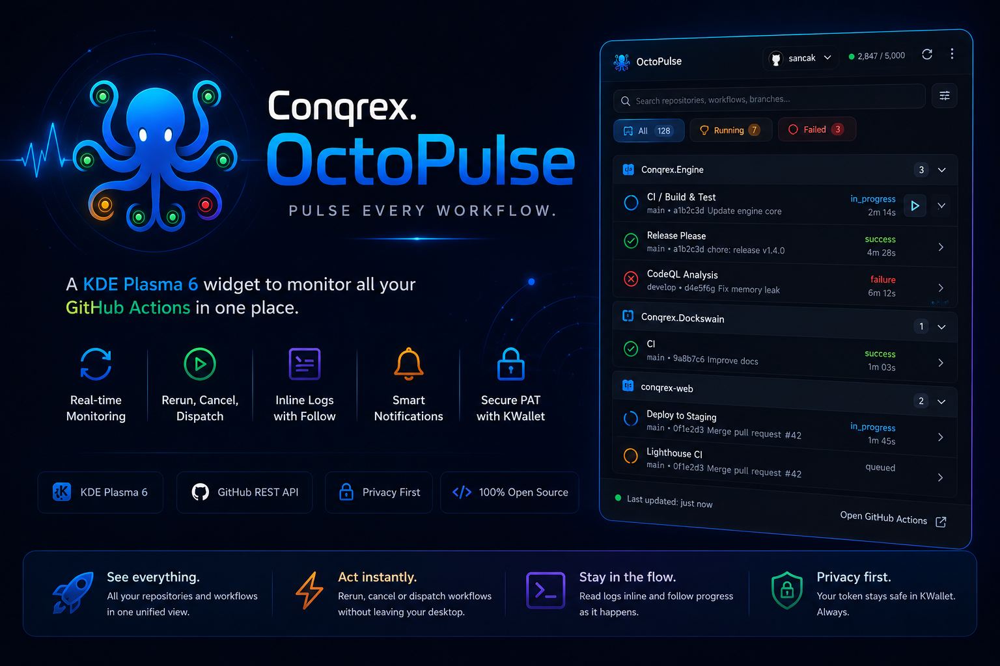

<p align="center">
  
</p>

<p align="center">
  <b>All your GitHub Actions. One panel widget.</b><br>
  A KDE Plasma 6 widget that follows every workflow run across all your
  repositories and organizations — live status, re-run, cancel, dispatch,
  and inline logs, without ever opening a browser tab.
</p>

<p align="center">
  <a href="LICENSE"></a>
  
  
  <a href="https://github.com/Conqrex/Conqrex.OctoPulse/releases"></a>
  <a href="https://github.com/Conqrex/Conqrex.OctoPulse/stargazers"></a>
</p>

<p align="center">
  <a href="#-install">Install</a> ·
  <a href="#-setup">Setup</a> ·
  <a href="#-features">Features</a> ·
  <a href="#-development">Development</a> ·
  <a href="docs/MILESTONES.md">Roadmap</a>
</p>

---

## ✨ Features

|     |     |
| --- | --- |
| 🔎 **Auto-discovery** | Watches every repo your token can see — yours, collaborations, and organizations. No manual lists. |
| 🟢 **Live panel state** | Panel dot glows green (all passing), pulses while runs are active, turns red with a failure count. |
| 🗂️ **Grouped feed** | Runs grouped per repository in collapsible accordions with per-repo health badges. |
| 📌 **Pinning** | Star a repository to keep it on top of the feed. |
| ⚡ **Act without a browser** | Re-run, re-run failed jobs only, cancel (with confirm), and launch `workflow_dispatch` with auto-generated input forms. |
| 📜 **Inline logs** | Per-job logs in a monospace pane with live follow while the job runs. |
| 🔔 **Smart notifications** | Ping on failure and on the first green after a red — silence on routine successes. |
| 🎛️ **Visibility control** | Hide whole organizations or single repos from a checkbox settings page. |
| 🧊 **OctoPulse dark look** | Navy GitHub-dark palette out of the box; one toggle to follow your system theme instead. |
| 🪶 **API-friendly** | ETag conditional requests (304s are free), adaptive polling that only speeds up while runs are active, live rate-limit meter with back-off. |
| 🔐 **Keyring-only secrets** | Your token lives in KWallet / Secret Service — never in a config file. |

## 📦 Install

### From source (any distro)

```sh
git clone https://github.com/Conqrex/Conqrex.OctoPulse.git
cd Conqrex.OctoPulse
./install.sh
```

Right-click your desktop or panel → **Add Widgets** → search **OctoPulse**.

### Arch / CachyOS (AUR)

```sh
makepkg -si -p packaging/aur/PKGBUILD
```

<details>
<summary>Reload Plasma after upgrading a local install</summary>

```sh
kquitapp6 plasmashell && kstart plasmashell
```

</details>

Package id: `com.conqrex.octopulse`

## 🔑 Setup

1. **Create a token** — GitHub → Settings → Developer settings:

   | Token type | What to pick | Sees |
   | --- | --- | --- |
   | **Classic** (recommended) | `repo` + `read:org` scopes | Personal **and all organizations** |
   | Fine-grained | One resource owner, Actions read/write + Contents read + Metadata read | That single owner only |

   > Organizations that restrict classic tokens must approve yours under
   > *Org Settings → Third-party access*.

2. **Connect** — widget settings → **Account** → paste token → **Save & Test**.
3. **Curate** — hide noisy orgs/repos under **Repositories**; tune polling,
   lookback window, and notifications under **General**.

The token is stored via `secret-tool` (Secret Service / KWallet) under
`service cnq-octopulse` and read back only at widget start.

## 🖥️ Requirements

| Component | Purpose | Required |
| --- | --- | --- |
| KDE Plasma 6 | The widget host | ✅ |
| `curl` | Job log download | ✅ |
| `libsecret` (`secret-tool`) or `kwallet-query` | Keyring token storage | ✅ |
| `libnotify` (`notify-send`) | Desktop notifications | optional |

## 🛠️ Development

Design and roadmap live in [docs/DESIGN.md](docs/DESIGN.md) and
[docs/MILESTONES.md](docs/MILESTONES.md).

```sh
# quick test loop, no plasmashell restart needed
plasmoidviewer -a package
```

Contributions welcome — issues and PRs alike.

## 🐙 Sibling project

[**Conqrex.Dockswain**](https://github.com/Conqrex/Conqrex.Dockswain) —
manage Docker hosts over SSH from your panel: containers, compose, logs,
SFTP file manager, and nginx/certbot tooling.

## 📄 License

[MIT](LICENSE) © Serhan Aydinicen
